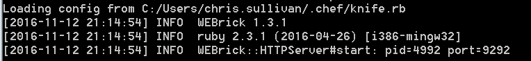
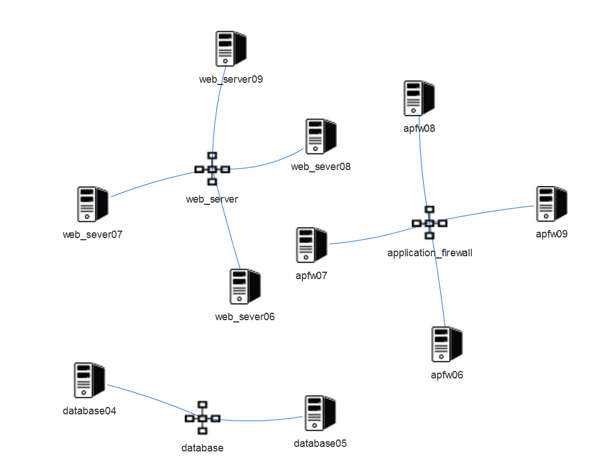

Chef Network Visualiser
=======================

Also known as "the bouncy thing".

This little application was written over the course of a weekend during Christmas 2015. 
The application came about because I wanted to see the Network schema from the viewpoint of the nodes registered with our Chef server.
There were hard coded elements so that I could see how the Network topology was organised.
For example 
* load balancer connect to application firewall 
* application firewall connect to varnish servers
* varnish servers connect to web servers ... etc

## Requirements

You will need 
* Ruby installed or Chef or ChefDK
* Bundler

Optional
* Access to a Chef server with Chef client configuration file 

## Installation

Clone or download the source code.

Go to the root of this application and use bundler to install gems

```
$ bundle install
```

## Running

This application is built on top of Sinatra, a RACK friendly application.
Run the web application with bundle exec

```
$ bundle exec rackup
```

The application will look for a Chef client configuration file in the following locations
* Root of this folder
* ~/.chef (users home folder, then .chef folder)

The command line should tell inform whether it is using a Chef client configuration file (client.rb or knife.rb) or using Chef zero for the purposes of demo.



The command line will also tell you which port the application is running on (default 9292).

Open a browser, enter the address as localhost plus the port the application is running on, press return and the index.html page will fire up ...


## Usage

The application has two modes out of the box
* View network by Chef Roles
* View network by Chef Environments

To switch between the modes you'll have to alter the code in application.rb, only one view can be active at any one time.

The first thing to do is select Role/Environment from the Cloud drop down.


After selecting the Role or Environment the matching nodes should appear.



From now you'll be able to
* Click a node to obtain more detail (displayed in the right hand pane)
* Search for a node/Role/Environment using the Search text box
* Put cursor on the nodes and flick them about (the bouncy thing)

## Ruby versions

Works with Ruby versions
* 1.9.3 
* 2.3.1p112 (2016-04-26 revision 54768) [i386-mingw32]

## Other

This was written for demo purposes / fun, code is not production ready, may contain bugs, does not contain nuts, some enjoyment maybe possible with the bouncy thing.

Enjoy, if you like this application or wish to improve it then please feel free to do so.

Next: An improved UI? ... to be continued.
